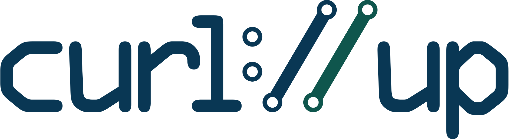
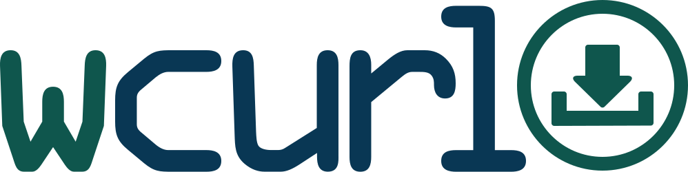

curl logos
==========

URL: [https://curl.se/logo/](https://curl.se/logo/)

You are free to use the images for purposes of showing your use of curl, your
product's use of curl, general or specific curl information, curl advocacy and
similar.

You are allowed to resize the images and host them yourself as you see fit.

## Official logo

This is the official curl logo. Made by Soft Dreams (Adrian Burcea) and
donated to the curl project on May 26 2016.

Applied minor fixes and tweaks on January 6, 2026 (by vsz).

| File                                             | Size  | Resolution | Format          |
|--------------------------------------------------|-------|------------|-----------------|
| [curl-logo.jpg](curl-logo.jpg)                   | 80K   | 2000 x 551 | JPEG            |
| [curl-logo.png](curl-logo.png)                   | 51K   | 2000 x 551 | PNG             |
| [curl-logo-master.svg](curl-logo-master.svg)     | 1.6K  | vector     | SVG             |
| [curl-logo.svg](curl-logo.svg)                   | 1.4K  | vector     | SVG             |
| [curl-transparent.png](curl-transparent.png)     | 51K   | 2000 x 551 | transparent PNG |

## The curl symbol

| File                                                       | Size | Resolution | Format          |
|------------------------------------------------------------|------|------------|-----------------|
| [curl-symbol.jpg](curl-symbol.jpg)                         | 37K  | 672 x 566  | JPEG            |
| [curl-symbol.png](curl-symbol.png)                         | 23K  | 672 x 566  | PNG             |
| [curl-symbol.svg](curl-symbol.svg)                         | 509  | vector     | SVG             |
| [curl-symbol-transparent.png](curl-symbol-transparent.png) | 23K  | 672 x 566  | transparent PNG |
| [curl-white-symbol.svg](curl-white-symbol.svg)             | 473  | vector     | SVG (white)     |

## Smallest curl vector logo winner

| File                                                       | Size | Resolution | Format          |
|------------------------------------------------------------|------|------------|-----------------|
| [curl-logo-tiny.svg](curl-logo-tiny.svg)                   | 734  | vector     | SVG             |

717 bytes with svgo, 352 with brotli q=11.

Made by Йоте <https://social.net.ua/users/joter>
Via: <https://social.net.ua/notice/B25SxW3zQZFV1GDGbI>

## curl up

| File                       | Size | Resolution | Format |
|----------------------------|------|------------|--------|
| [curl-up.png](curl-up.png) | 63K  | 2500 x 688 | PNG    |
| [curl-up.svg](curl-up.svg) | 2.3K | vector     | SVG    |

## trurl

| File                                               | Size | Resolution | Format |
|----------------------------------------------------|------|------------|--------|
| [trurl-logo.jpg](trurl-logo.jpg)                   | 77K  | 2000 x 860 | JPG    |
| [trurl-logo.svg](trurl-logo.svg)                   | 30K  | vector     | SVG    |
| [trurl-logo-inkscape.svg](trurl-logo-inkscape.svg) | 83K  | vector     | SVG    |

The original [robot image](https://pixabay.com/vectors/adorable-android-artificial-2861801/) is made
by Christian Plaza.

## wcurl

| File                             | Size | Resolution | Format |
|----------------------------------|------|------------|--------|
| [wcurl-logo.png](wcurl-logo.png) | 49K  | 2000 x 501 | PNG    |
| [wcurl-logo.svg](wcurl-logo.svg) | 3.3K | vector     | SVG    |

## curl logo colors

- curl blue: `#093754`
- curl green: `#0f564d`

## curl logo font

The used font is called [OCRAStd](https://fontzone.net/font-details/ocrastd).
